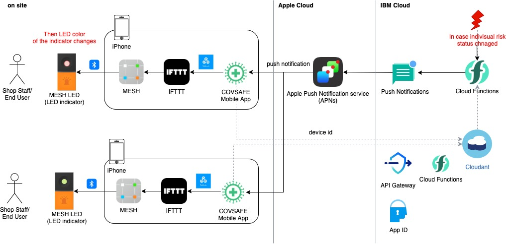
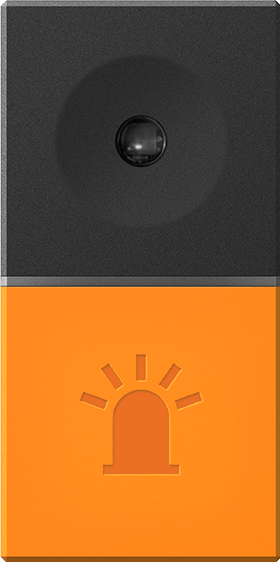
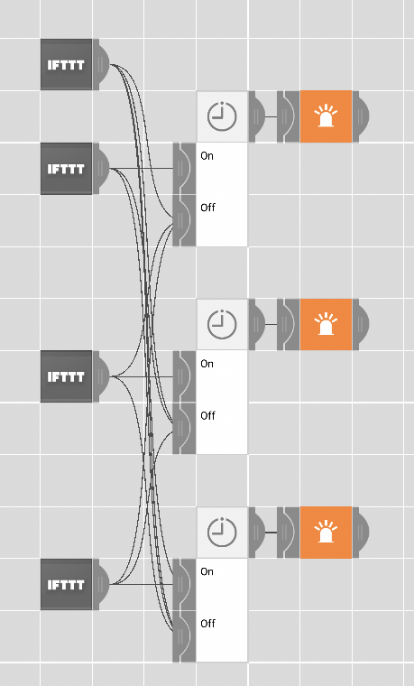

# indicator

## About summary of the indicator system in COVSAFE solution

- The summary of indicator system in COVSAFE solution is following.
    -  COVSAFE Risk Calculator/Notifier triggers the indivisual risk state change and sends a push notification to the indivisual's mobile device via the Push Notifications service. These sequences are performed by Cloud Functions configured as a COVSAFE backend. Here, the backend uses the device ID as an identifier to identify the indivisual to whom push notifications are sent; the COVSAFE mobile app stores the device ID in the backend cloudant in association with the logged-in App ID user. The back-end COVSAFE risk notifier identifies the destination of the pusho notofications by referring to the DB information in this cloudant.
    - COVSAFE mobile app executes an IFTTT incoming webhook by the notification handler when it receives a push notification, and then the corresponding MESH app script is executed. and changes the color of the MESH LED (LED indicator device) paired with the BLE.

## How to install and Setup
### LED indicator device
- [MESH LED Tag - MESH-100LE](https://meshprj.com/jp/products/blocks/MESH-100LE.html)

    
    
    - The comercially available product of SONY Business Solution Corp.
    - Communication method: Bluetooth Low Energy
    - size: 24mm x 48mm x 12mm
    - wight: 13g
    - Dimmirable LED
    - Control it from a standard app provided by the vendor.
        - On, blinking, and off.

### MESH App
- Import the MESH [recipe file](./COVSAFE.mesh) into your MESH App.
    - MESH HOME -> briefcase icon -> Import recipe
    - You needs to store the importing recipe file in the folder named "MESH" of Files App in advance.

    
    
    |block|method|Arguments|Input|
    |---|---|---|---|
    |IFTTT#1|Receive|EventID: turnoff|n/a|
    |IFTTT#2|Receive|EventID: turnred|n/a|
    |IFTTT#3|Receive|EventID: turnyellow|n/a|
    |IFTTT#4|Receive|EventID: turngreen|n/a|
    |Timer#1|Interval|Interval: 15sec|on: IFTTT#2, off: [IFTT#1, IFTTT#3, IFTTT#4]|
    |Timer#2|Interval|Interval: 15sec|on: IFTTT#3, off: [IFTT#1, IFTTT#2, IFTTT#4]|
    |Timer#3|Interval|Interval: 15sec|on: IFTTT#3, off: [IFTT#1, IFTTT#2, IFTTT#3]|
    |LED#1 |Light Up|Color: Red, Brightness: 5, Duration: 30|Timer#1|
    |LED#2 |Light Up|Color: Yellow, Brightness: 5, Duration: 30|Timer#2|
    |LED#3 |Light Up|Color: Green, Brightness: 5, Duration: 30|Timer#3|

### IFTTT
- Use [IFTTT](https://ifttt.com/my_applets), because  using IFTTT is one of the few officially supported programmable interfaces of MESH.
- Create the following IFTTT Applets.

|IFTTTT Applet|this|that|Event Name|Event ID|
|---|---|---|---|---|
|If Maker Event "push\_notification\_received\_turn\_off", then Send an event to MESH app|Webhook|MESH app|push\_notification\_received\_turn\_yellow|turnoff|
|If Maker Event "push\_notification\_received\_turn\_red", then Send an event to MESH app|Webhook|MESH app|push\_notification\_received\_turn\_yellow|turnred|
|If Maker Event "push\_notification\_received\_turn\_yellow", then Send an event to MESH app|Webhook|MESH app|push_notification_received_turn_yellow|turnyellow|
|If Maker Event "push\_notification\_received\_turn\_green", then Send an event to MESH app|Webhook|MESH app|push\_notification\_received\_turn\_yellow|turngreen|

### COVSAFE Mobile App
- Install COVSAFE Mobile App.
- see README in the COVSAFE mobile-app repository for more details.

### Push notifications
- Setup Push notifications.
- see README in the COVSAFE push-notifications repository for more details.
